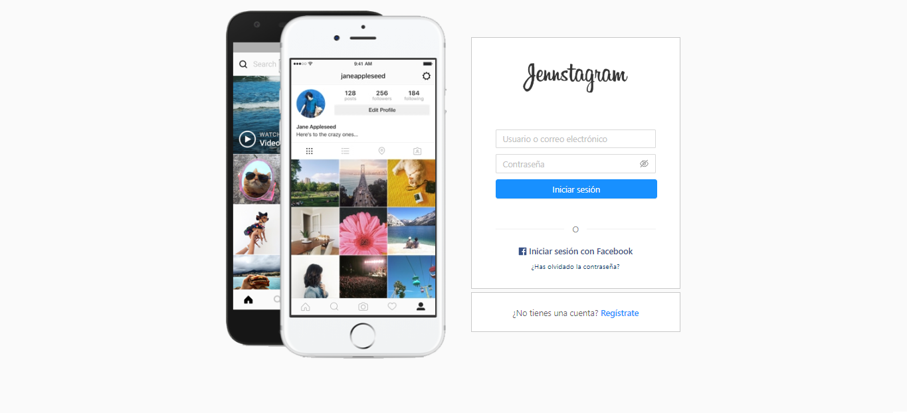
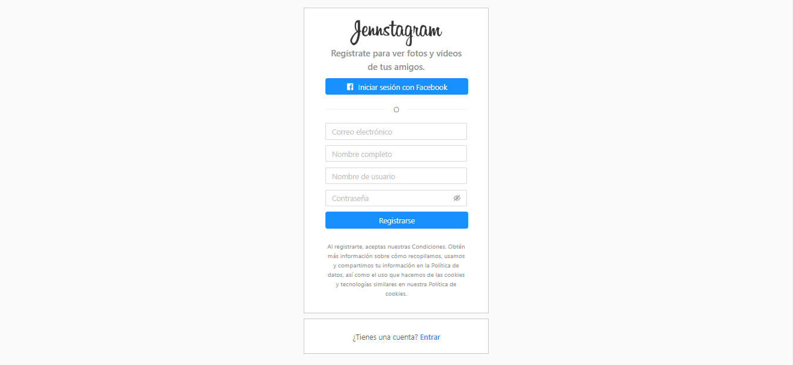
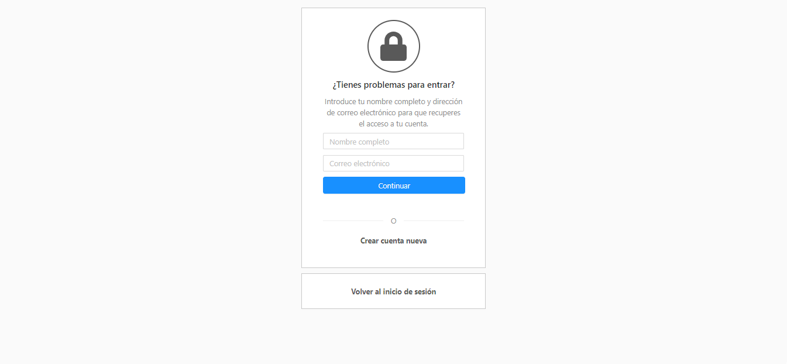
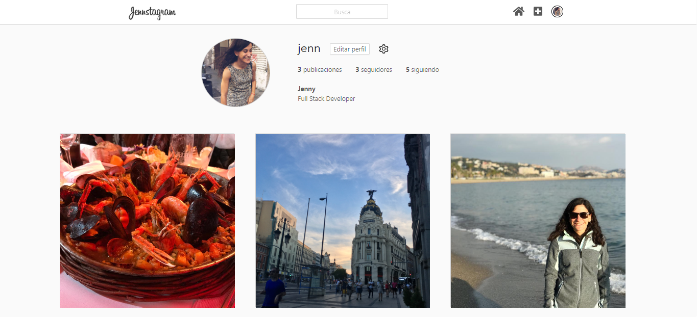
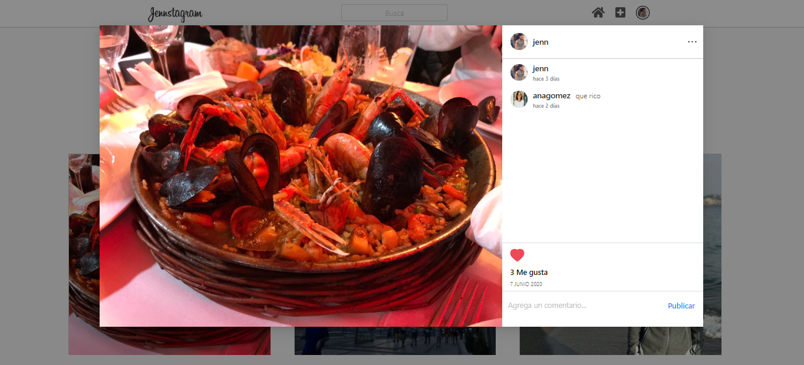

# Jennstagram

This was my final coding Bootcamp project: my own social network inspirated on Instagram.

It was made with React (Hooks & Redux), Ant Design, Sass, PHP (Laravel), Eloquent, MySQL & Amazon Web Services.
You can register here [Jennstagram](http://jennstagram.herokuapp.com/) and try it by yourself.

## Views

### Home

### Registration

### Reset Password

### Feed

### Profile

### Post

